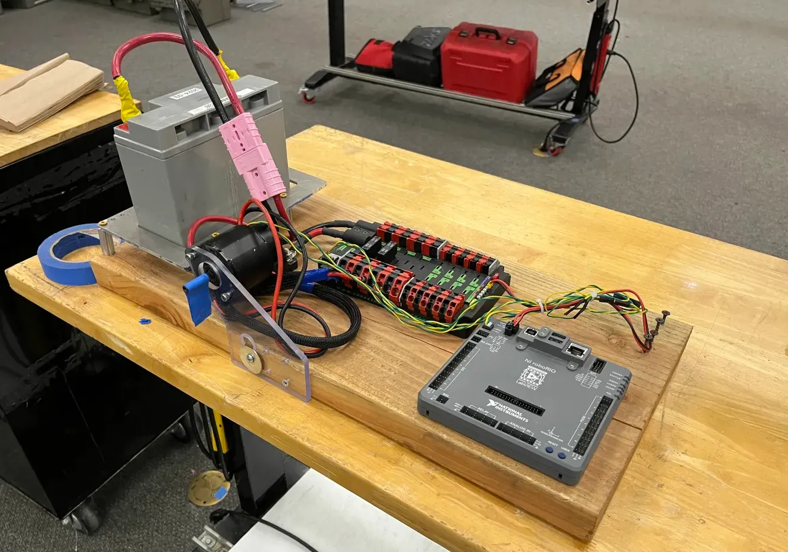
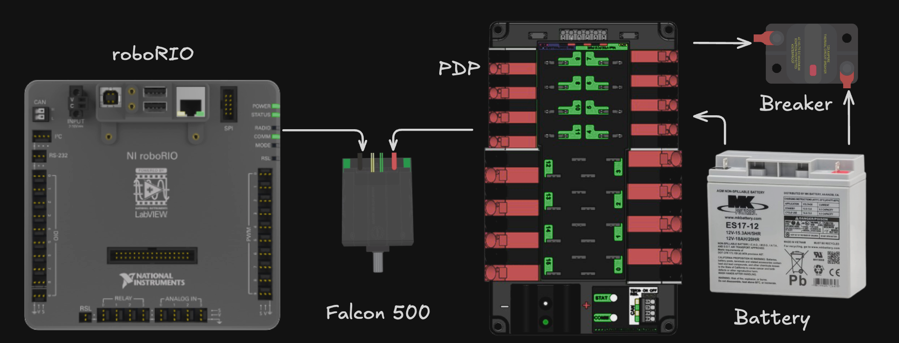
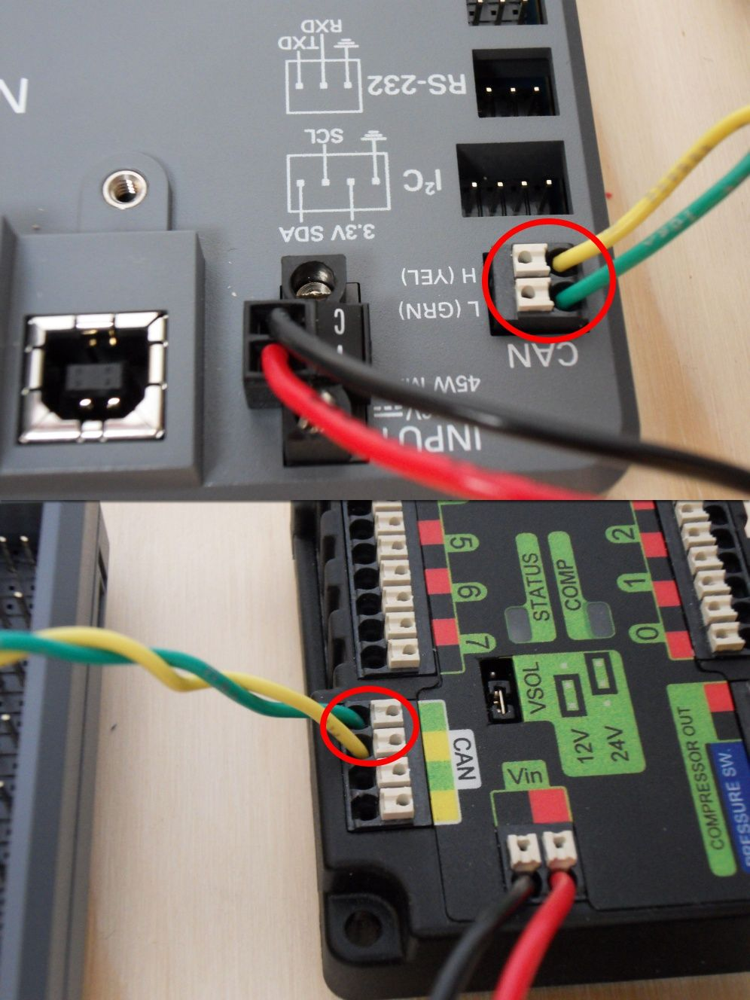
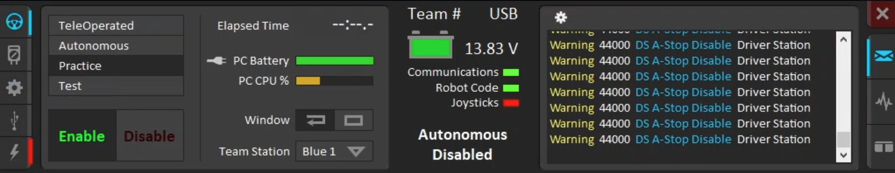
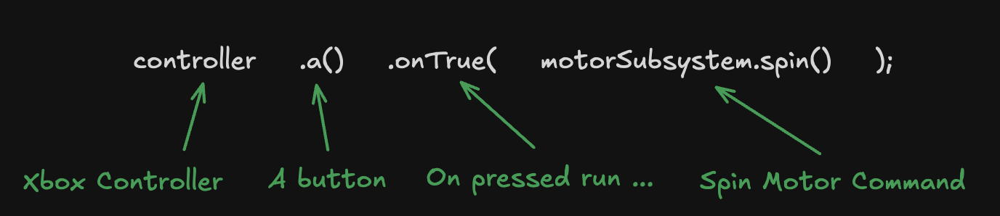
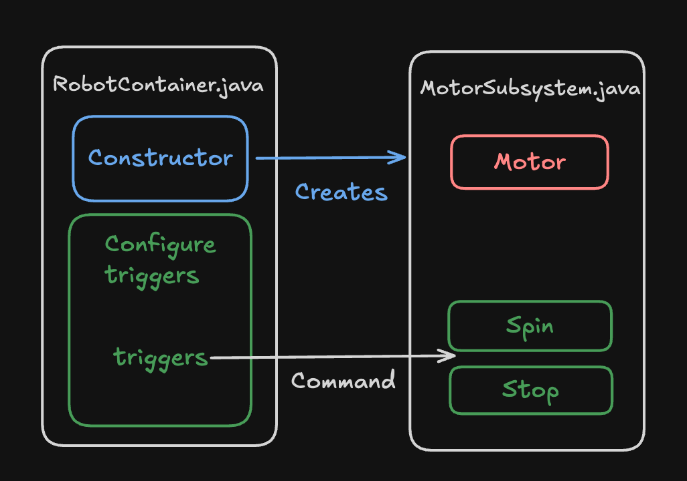

# **My First Robot Project**

For our first programming project we will be focusing on the programming test board. Its a simple board with a motor, computer, and battery that will allow us to test deploying code and control logic.

<figure markdown="span">
    { width="600" }
  <figcaption>The 6238 Programming Test Board</figcaption>
</figure>

## **Test Board Components**
To begin lets go over the components of the test board. The test board contains a roborio, the main computer, which runs our robot and communicates with the other components on the board. Next we have a PDP, or power distibution port, which manages the power onboard the circut. It takes in the battery voltage through the breaker and distributes it to all the motors and to the roborio. Finally we have the actual motor, in this case a Falcon 500. The Falcon 500 is a powerful motor with a built in motor controller for precise and accurate movement. Everything is connected through the CAN bus which allows for data transfer between all robot components.

<figure markdown="span">
    { width="600" }
  <figcaption>Wiring Diagram of the Programming Test Board</figcaption>
</figure>

<figure markdown="span">
    {width="300"}
  <figcaption>This is the can bus. Here you can see it connected to the roborio and pdp. It is a set of green and yellow wires twisted together to transmit data.</figcaption>
</figure>


## **Starting the Code for your Subsystem**
Start by opening WPILib VScode on one of the driver station laptops. Once VScode is opened click the terminal tab bar in the top bar and click new terminal. Once the terminal is opened you can clone the codebase and open it following the instructions below.

### **Terminal Basics: CD**
The ```cd``` command is commonly used when navigating the terminal. It allows you to navigate to different folders in the terminal. ```cd <folder>``` allows you to go into a specific folder. ```cd ..``` goes back a folder into the parent folder. 

### **Clone the Codebase**
To clone the codebase we need to use the cd command to go to the desktop folder. Once you opened the terminal from the top bar type the following command inside: ```cd Desktop``` and press ++enter++ to run it. Then type the following command: ```git clone https://github.com/6238/ProgrammingTestBoard.git <<YourName>>``` and press ++enter++ to run it.

### **Opening in VSCode**
Once you have cloned the codebase open the folder in vscode by clicking File -> Open Folder.. and selecting the Desktop/<<YourName>> Folder. Now your ready to begin coding!

## **Building and Deploying Code**
Now that we have a basic frc codebase its time to build and deploy our code!
To build and deploy our code to a robot relies on the command pallette. Open the command pallette with ++ctrl+shift+p++ and type ```WPILib deploy``` and press ++enter++ to deploy.

When you run deploy wpilib will check to see if a robot is connected. Since the platform is not currently connected, it should error.
Here, Deploy will open a terminal at the bottom of your screen allowing you to see if any errors occur during the build process. These could be formatting errors, connectino errors, or code mistakes. Since the robot is not connected, if you scroll up you should see an error saying that the roboRIO could not be detected.

To fix this, we need to connect to the test platform. Start by flipping the circut breaker with the battery connected and plugging in an ethernet cable into the roboRIO's ethernet port, connecting it to the driverstation laptop. On the laptop make sure to open the driverstation app through the windows menu. This program allows you to connect the robot and enable it. Once the robot is conncted (you see this on the driverstation app), use the ```WPILib deploy``` command again to deploy the code to the robot and test.

<figure markdown="span">
    { width="600" }
  <figcaption>This is the driver station. Make sure to set it to Teleoperated instead of Practice mode.</figcaption>
</figure>

## **Coding our first Subsystem**
To code our first ever subsystem type open the search pallette with ++ctrl+p++ and type ```MotorSubsystem.java``` and press Enter.
```java
package frc.robot.subsystems;

import edu.wpi.first.wpilibj2.command.SubsystemBase;

public class MotorSubsystem extends SubsystemBase {
    
    public MotorSubsystem() {

    }
}
```
!!! danger "IMPORTANT"
    Remember to always press ++Ctrl+S++ to save your code after every edit! I have forgotten to do this far too many times :(

```public class MotorSubsystem extends SubsystemBase``` is the line that defines our subsystem class. Classes are like cookie cutters, defining how an object should be structured. We can instantiate classes with the new keyword just like how you would use a cookie cutter to cut out a cookie (object).

```extends Subsystem``` means that our class will be recognized as a subsystem and inherit special propeties.

Finally ```public MotorSubsystem()``` is our constructor. It defines what needs to happen whenever a new object is created using that class.

If the code still doesn't make sense, thats ok. Classes, constructors and object are very difficult and require more practice to be able to fully understand. If your interseted in learning more this video has a great explanation for classes, objects, and properties: <a href="https://www.youtube.com/watch?v=IUqKuGNasdM">https://www.youtube.com/watch?v=IUqKuGNasdM</a>

### **Creating our first MotorController**
Now its time to create our first motor controller. This object allows us connect with a motor on our robot and sent control messages to it. In this case, our test platform uses a TalonFX controller so we will use the same object in our code. Modify your code to look like the following:

```java
package frc.robot.subsystems;

import com.ctre.phoenix6.hardware.TalonFX;

import edu.wpi.first.wpilibj2.command.SubsystemBase;

public class MotorSubsystem extends SubsystemBase {
    private TalonFX motor; // Define the motor controller variable
    
    public MotorSubsystem() {
        motor = new TalonFX(10); // Instantiate the motor controller with an ID of 10
    }
}
```

Here we create a TalonFX motor controller by defining it in the class and then creating it in the contstructor. Notice how the names in code match the names of things in the real world. This is because code often mirrors the mechanism that it tries to control.

We store this motor controller in something called a variable. Variables are like little boxes that can hold our objects when programming. In this case we create a variable called motor that holds a TalonFX motor controller. Note that when creating the controller we use the syntax ```motor = new TalonFX(10);```. This code creates a new instance of the TalonFX class (like using the cookie cutter to create a new cookie) and passes in 10 for the ID meaning, tying that motor controller to the motor with ID 10.

!!! note
    The ``//`` symbol defines a comment. All characters on this line after the symbol are not processed by the code and are ignored.
    Notice that many of the lines of code end with a semicolon. This is part of the java syntax and the only lines that dont end with semicolons usually end with open or closed braces.

### **Spinning the Motor**
Just a few more steps before we can finally spin the motor! Now we need to create something called a command. Commands are a way of running code in FRC. For our code we only need to know about the simplest type of command: ```runOnce()```. This create a command that will run a function once, about as simple as it gets.

!!! note
    Functions are a way to reuse a piece of code. For example, I can create a function that spins a motor called ```spin```. Then whenever I want to spin the motor, all I have to do is write ```spin();``` and that will run the code inside the spin function.

Lets create a simple runOnce command to spin the motor at a set speed. Modify your code to look like the following:
```java
package frc.robot.subsystems;

import com.ctre.phoenix6.hardware.TalonFX;

import edu.wpi.first.wpilibj2.command.Command;
import edu.wpi.first.wpilibj2.command.SubsystemBase;

public class MotorSubsystem extends SubsystemBase {
    private TalonFX motor;
    
    public MotorSubsystem() {
        motor = new TalonFX(10);
    }

    public Command spin() {
        return runOnce(() -> motor.setVoltage(3));
    }

    public Command stop() {
        return runOnce(() -> motor.setVoltage(0));
    }
}
```

Here we create two commands. One called ```spin``` which sets the motor voltage to 3 volts, and another called ```stop``` which sets the motor voltage to 0 volts. Each of these fuctions returns a command that calls a piece of code, in this case the ```motor.setVoltage``` function. Note the -> operator. This is a symbol that creates a one line function, allow us to call motor.setVoltage(3) in a function, and then pass that into the runOnce command, all in one line.

### **Triggers**
Our final step before spinning the motor for the very first time. To spin the motor we need to go to ```RobotContainer.java```. To do this open the search pallette with ++ctrl+p++ and search for it. This file contains all the triggers and subsystem setup for our code. In this file write the following code:

```java
package frc.robot;

import edu.wpi.first.wpilibj2.command.Command;
import edu.wpi.first.wpilibj2.command.Commands;
import edu.wpi.first.wpilibj2.command.button.CommandXboxController;
import frc.robot.subsystems.MotorSubsystem;

public class RobotContainer {
  public MotorSubsystem motorSubsystem;
  public CommandXboxController controller;

  public RobotContainer() {
    motorSubsystem = new MotorSubsystem();
    controller = new CommandXboxController(0);
    
    configureBindings();
  }

  private void configureBindings() {
    controller.a().onTrue(motorSubsystem.spin());
    controller.a().onFalse(motorSubsystem.stop());
  }

  public Command getAutonomousCommand() {
    return Commands.print("No autonomous command configured");
  }
}
```

Our code for ```RobotContainer.java``` is structured into two parts. First, we create a motorSubsystem and ```CommandXboxController``` the same way we did for the TalonFX controller in our ```MotorSubsystem``` class. Second, we call the ```configureBindings()``` method. This method is where we setup an triggers for our commands.

Here is where the power of commands begins to show. In configure bindings we put ```controller.a().onTrue(motorSubsystem.spin());```. This code exectues in the the following way:
<figure markdown="span">
    { width="600" }
  <figcaption>Diagram of the Trigger Line of Code</figcaption>
</figure>

Now that we have written triggers for our commands, its time to test! Deploy the robot code to the test platform, open the driver station, and when ready, click enable and teleop mode in the driver station to test it out!

Here is the final structure of our code:
{ width="600" }


## **Challenges**
Try these before you move on. If you get stuck, spend ~10-20min on your own before asking for help.

1. Change the voltage in ```spin``` to something else between 0 and 6. Deploy and press A. Then put it back.

2. Copy ```spin``` and make ```spinFast``` with a higher voltage. Bind B the same way A is bound: press to ```spinFast```, release to ```stop```. Deploy and try both buttons.